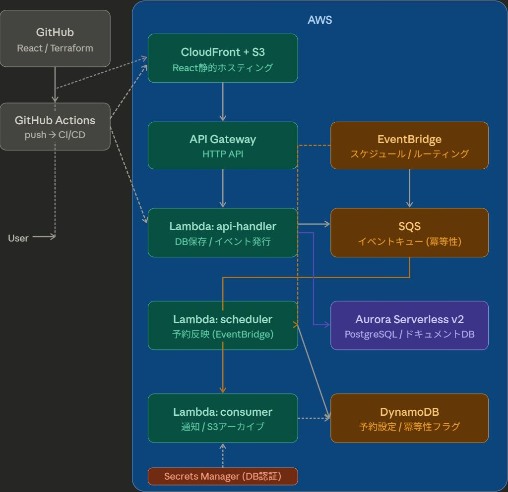

# Legal Event Flow

ホームページの法務規約ページ（利用規約、プライバシーポリシー）管理システム。文書変更をトリガーに、イベント駆動で通知・DB更新・静的サイト反映を自動実行するサーバーレスWebアプリ。

## Architecture

- **Frontend**: React (Vite) + TypeScript + Tailwind CSS → S3 + CloudFront
- **Backend**: AWS Lambda (Node.js/TypeScript) × 4関数
- **Event Bus**: EventBridge + SQS（疎結合・冪等性保証）
- **DB**: Aurora Serverless v2 (PostgreSQL) + DynamoDB
- **IaC**: Terraform（全リソース管理）
- **CI/CD**: GitHub Actions（OIDC認証）

## Diagram


## Database Design

本システムは性質の異なる2種類のデータを、それぞれ最適なDBに分けて管理しています。

### Aurora Serverless v2 (PostgreSQL) — 不変の記録

**「一度書いたら変えない」データの永続ストア。**

法務ドキュメントは、改ざんできない履歴として保持する必要があります。Aurora はリレーショナルDB の参照整合性（外部キー制約）と `SERIAL` による自動採番を活かし、ドキュメントの全バージョンを追記のみで管理します。過去バージョンの削除・上書きはアプリケーション層で禁止し、監査ログとしての完全性を保ちます。

| テーブル | 役割 |
|---|---|
| `documents` | 規約の種類を管理（`slug`: `terms-of-service` など） |
| `document_versions` | Markdown本文・バージョン番号・公開ステータスを保持。追記のみ |

### DynamoDB — 動的な状態管理

**「頻繁に変わる・一時的な」データの高速ストア。**

スケジュールや処理フラグは更新頻度が高く、スキーマも柔軟に変えたいデータです。DynamoDB の PAY_PER_REQUEST 課金と TTL 自動削除を活用し、Aurora に一時データを持ち込まない設計にしています。

| テーブル | 役割 |
|---|---|
| `ScheduledUpdates` | 予約反映の待ちキュー。`ApplyAt`（UNIX Timestamp）でGSIクエリし、scheduler-handler が毎時チェック |
| `UserSettings` | ユーザーごとの通知設定。PK: `UserId` でO(1)アクセス |
| `IdempotencyKeys` | SQSメッセージの重複処理防止フラグ。TTL 24時間で自動削除 |
| `SchemaMigrations` | Auroraマイグレーションの適用履歴。鶏卵問題を避けるためAurora側には置かない |

### 使い分けの判断基準

```
変更履歴を残す・整合性が重要  →  Aurora
一時的・高頻度更新・TTL管理   →  DynamoDB
```

---

## Getting Started

### 前提条件
- AWS CLI 設定済み
- Terraform v1.7+
- Node.js v20+

### 初回セットアップ

```bash
# 1. Terraform state 用 S3 バケットを手動作成（一度だけ）
aws s3 mb s3://your-tf-state-bucket --region ap-northeast-1

# 2. インフラ構築
cd terraform
terraform init -backend-config="bucket=your-tf-state-bucket"
terraform apply -var="github_repo=your-org/legal-event-flow"

# 3. フロントエンド開発
cd frontend && npm install && npm run dev
```

### 環境削除

```bash
cd terraform && terraform destroy
# ⚠️  terraform state バケット自体は手動削除が必要
# ⚠️  CloudFront のエッジキャッシュ消去に数十分かかる場合あり
```

## CI/CD

`main` ブランチへの push で以下が自動実行されます:

```
terraform apply
  ↓
Lambda デプロイ (4関数)
  ↓
DB マイグレーション (migrate-handler)
  ↓  ← 並列
React ビルド & S3 デプロイ + CloudFront キャッシュ無効化
```

## GitHub Secrets 設定

| Secret | 説明 |
|---|---|
| `AWS_ACCOUNT_ID` | AWSアカウントID |
| `TF_STATE_BUCKET` | Terraform state用S3バケット名 |
